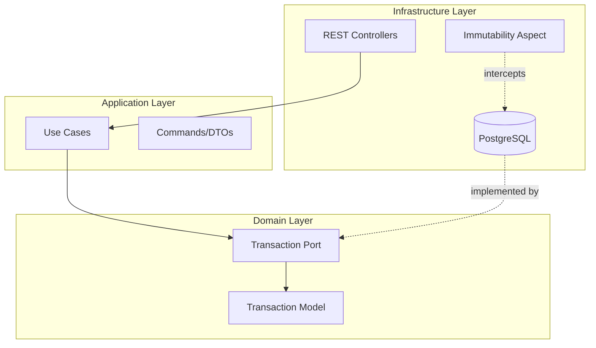

# 🏦 BankLedger: Financial Immutability Engine

> A robust, append-only financial ledger microservice enforcing strict data immutability through Clean Architecture and Aspect-Oriented Programming (AOP).

[](https://java.com/)
[](https://spring.io/projects/spring-boot)
[]()
[](https://www.docker.com/)

## 🚀 The Challenge & Solution

In real-world banking systems, account balances are never updated via `UPDATE` statements, and transactions are never `DELETED`. Mistakes are fixed via compensatory transactions. 

**BankLedger** is a core banking microservice designed to handle credit and debit transactions using an **Append-Only** pattern. It dynamically calculates account balances by replaying historical transactions in memory. 

### ✨ Key Technical Features
*   **Architectural Immutability:** Uses **Spring AOP** to intercept and block any `delete` operations at the repository level.
*   **JPA Lifecycle Hooks:** Utilizes `@PreUpdate` to prevent any modifications to existing transaction records.
*   **Clean Architecture:** Strict separation of concerns (Domain, Application, Infrastructure) without framework lock-in at the core.
*   **Containerized:** Multi-stage Docker build for optimized, lightweight production deployment.
``
## 🏗️ Architecture Design

The project strictly follows **Clean Architecture** principles. The Domain has zero dependencies on Spring Boot or external libraries.



## 🔌 API Endpoints

| Method | Endpoint | Description |
| :--- | :--- | :--- |
| `POST` | `/api/ledger/transaccion` | Registers a new transaction (DEPOSIT/WITHDRAWAL). |
| `GET` | `/api/ledger/{cuentaId}/saldo` | Calculates the real-time balance of an account. |
| `GET` | `/api/ledger/{cuentaId}/historial` | Retrieves the immutable transaction history. |

### Example Payload (POST)
```json
{
  "cuentaId": "CUENTA-001",
  "monto": 1500.00,
  "tipo": "DEPOSITO"
}
```

## 🛡️ Security: The AOP Firewall
Any attempt to delete a record by a developer or compromised endpoint will be automatically blocked by the AOP Aspect, throwing a `SecurityException` before reaching the database:
```java
@Before("execution(* org.springframework.data.jpa.repository.JpaRepository.delete*(..))")
public void preventDeletion() {
    throw new SecurityException("SECURITY ALERT: The Ledger is immutable.");
}
```

## 🛠️ Running the Project

### Using Docker (Recommended)
1. Clone the repository:
   ```bash
   git clone https://github.com/Fab0705/BankLedger.git
   ```
2. Build and run using Docker Compose (includes PostgreSQL):
   ```bash
   docker-compose up -d --build
   ```

### Local Development (H2 In-Memory DB)
1. Ensure Java 21 is installed.
2. Run the Maven wrapper:
   ```bash
   ./mvnw spring-boot:run
   ```

## 🧪 Testing Strategy
*   **Domain Unit Tests:** Fast, isolated tests verifying business rules using **JUnit 5**.
*   **Infrastructure Integration Tests:** Verifies JPA mappings, mathematical sum aggregations (`@DataJpaTest`), and AOP interception logic.
